<!-- machine_translated: true -->

<!-- pre-align:aligned sig=c164d17a97df -->

## Database > RDS for PostgreSQL > Backup and Restore { #database-rds-for-postgresql-backup-and-restore }

## Backup { #backup }

You can prepare in advance to recover the DB instance's database in case of failure. You can perform backups from the console whenever necessary, or you can configure it to perform backups periodically. During backup, the storage performance of the DB instance may degrade. We recommend that you perform backups during off-peak hours to avoid impacting your services. If you do not want the backup to degrade performance, you can use a high-availability configuration, back up only increments of data since the previous backup, or perform backups from a Read Replica.

RDS for PostgreSQL uses the pg_basebackup tool to back up databases. To restore to a backup of an external PostgreSQL or to a backup of RDS for PostgreSQL, you must use the same version of pg_basebackup used by RDS for PostgreSQL. pg_basebackup version according to the DB engine version is as follows.

| PostgreSQL version | pg_basebackup version |
|---------------------|------------------|
| <strong>17</strong> |                  |
| 17.10               | 17.10            |
| 17.6                | 17.6             |
| 17.4                | 17.4             |
| 17.2                | 17.2             |
| <strong>14</strong> |                  |
| 14.23               | 14.23            |
| 14.19               | 14.19            |
| 14.17               | 14.17            |
| 14.15               | 14.15            |
| 14.6                | 14.6             |

* For more information about installing pg_basebackup, refer to the PostgreSQL website.
  * https://www.postgresql.org/docs/17/app-pgbasebackup.html

The following settings are applied to backup and it applies to both auto and manual backups.

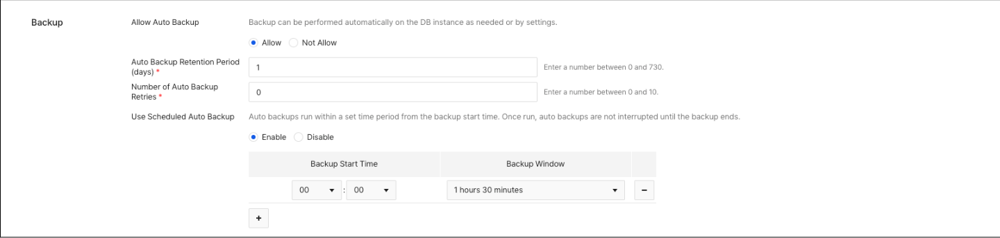

### Manual Backup { #manual-backup }

If you want to permanently store a database at a specific point in time, you can perform a backup manually from the console. Unlike auto backups, manual backups are not deleted when a DB instance is deleted unless you explicitly delete the backup. To perform a manual backup from the console

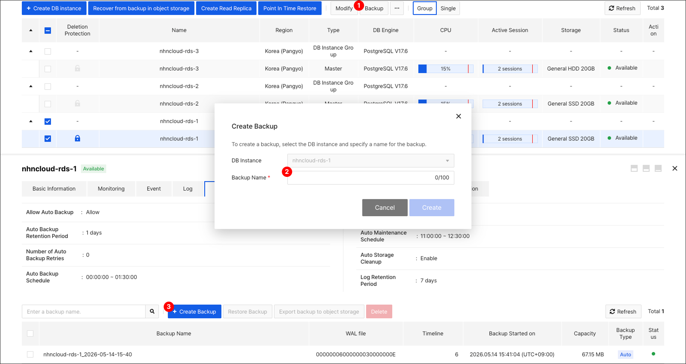

❶ After selecting the DB instance to back up, click **Backup**, and **Create Backup** and the pop-up window appears.
    - If you click **Backup** without selecting DB instance, you can select DB instance from the drop-down menu within the **Create Backup** pop-up window.
❷ Enter a name of the backup. There are the following restrictions.

* Backup name has to be unique for each region.
* Backup names are alphabetic, numeric and - _ between 1 and 100 Only and the first character has to be an alphabet letter.

Or, on the **Backup** tab,

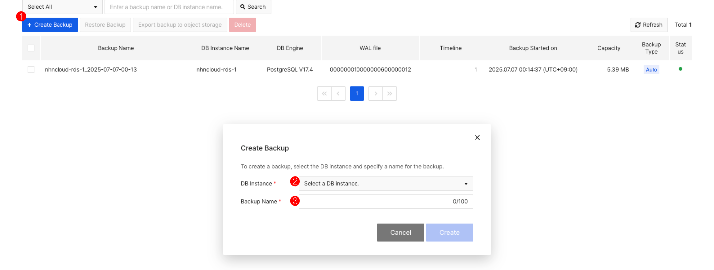

❶ Click **+ Create Backup** and the **Create Backup** pop-up window will appear.
❷ Select the DB instance on which to perform the backup.
❸ Enter a name for the backup and click **Create** to request backup creation.

#### Create Incremental Backup Manually

You can create an incremental backup by selecting a baseline backup on the **Backup** tab and then clicking **Create Incremental Backup**. Some backups cannot be selected as a baseline backup. For a detailed description of baseline backups, see [Baseline Backup](#baseline-backup).

### Auto Backup { #auto-backup }

Even when performing manual backups, auto backups can be performed if necessary for restore jobs or depending on the auto backup schedule. If you set the backup retention period for DB instance to 1 day or longer, auto backups are activated, and backups are performed at the specified time. auto backups have the same life cycle as DB instances. When a DB instance is deleted, all archived auto backups are deleted. The settings that Auto Backup supports are as follows.

#### Auto Backup Retention Period (days)

* Sets the time period for storing backups on storage. It can be kept for up to 730 days, and if the backup retention period changes, the expired automatic backup files will be deleted immediately.

!!! danger "Caution"
    Incrementally created backups are deleted when the baseline backup is deleted, even if the auto backup retention period has not passed.

#### Number of Automatic Backup Retries

* You can set the auto backup to retry if it fails due to DML query load or for other various reasons. You can retry a maximum of 10 times. Depending on the auto backup run time setting, you might not try again even if there are still more retries.

#### Auto Backup Strategy

* You can specify a strategy for performing auto backups.
    * Daily full backup: Back up entire data daily.
    * Daily full and incremental backups: One full backup of your data each day, and multiple incremental backups.
    * Weekly full backups and daily incremental backups: One full backup of your data on certain days of the week, and one incremental backup on the remaining days of the week.
    * Daily snapshot backup: Back up all data daily via snapshots.

#### Full Backup Days of Week

* Can only be specified when using the weekly full backup and daily incremental backup strategies. You must select at least one day for full backup days of week, and full backups will occur on the selected days and incremental backups will occur on the unselected days.

#### Backup Execution Target

* Select the DB instance for performing auto backups. If you select Standby or Read Replica in addition to Primary, you can reduce the backup load on Primary.
* You can specify the backup method as one of the following:
    * One of the selected candidates: Automatically performs a backup on the DB instance with the lowest system load among the selected DB instances.
    * All selected candidates: Performs backups on all selected DB instances.

#### Backup Execution Time

* You can set the time at which backups are performed automatically. The setting consists of a backup start time and a backup window. You can configure multiple backup times as long as they do not overlap. Backups are performed at a random point within the backup window based on the backup start time. The backup window is not related to the total time required to complete a backup. The time required for a backup is proportional to the size of the database and varies depending on the service load. If a backup fails and the backup window has not been exceeded, the backup is retried according to the backup retry count configured.

The name of an automatic backup is assigned in the format `{DB instance name}_yyyy-MM-dd-HH-mm`.

!!! danger "Caution"
    A backup might not be performed in some situations, such as when a previous backup does not terminate.
    If no incremental baseline backup exists, a full backup might be performed even though it is the scheduled turn to perform an incremental backup.
    For a detailed description of incremental baseline backups, see [Baseline Backup](#baseline-backup).

### Backup Storage and Pricing { #backup-storage-and-pricing }

All backup files are uploaded to the internal backup storage and saved. For manual backups, they are permanently stored until they are deleted separately and backup storage charges are incurred depending on the backup capacity. Auto backups are stored for the retention period you set, and you are charged for the portion of the total size of the auto backup file that exceeds the storage size of your DB instance. You cannot directly access the internal backup storage where the backup files are stored.

### Export Backup { #export-backup }

#### Export Files While Executing Backup

After backing up, you can export the backup file to user object storage. Incremental backups are not supported.

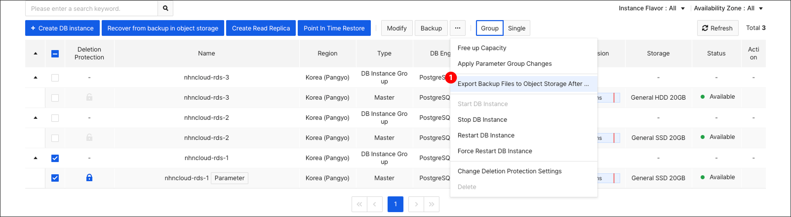

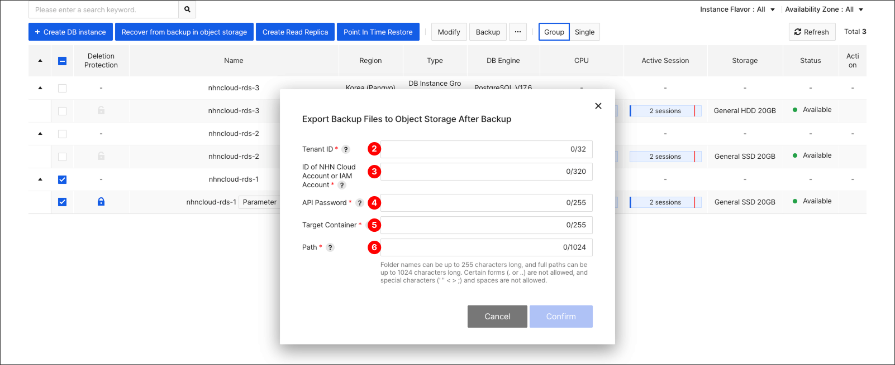

❶ After selecting the DB instance to backup, click **Export Backup File to Object Storage After Backup** from the drop-down menu, and a settings pop-up screen will appear.
❷ Enter the tenant ID of the object storage where the backup will be stored. The tenant ID can be found in the API endpoint settings.
❸ Enter the NHN Cloud account or IAM account of the object storage where the backup will be saved.
❹ Enter the API password for the object storage where the backup will be stored.
❺ Enter the container in object storage where the backup will be stored.
❻ Enter the path to the backup that will be stored in the container. The folder name can be up to 255 bytes, and the full path can be up to 1024 bytes. You cannot use certain forms (. or ..), and you cannot enter special characters (' " < > ;) and spaces.

#### Export Backup Files

You can export backup files stored in internal backup storage to user object storage. Incremental backups are not supported.

❶ On the Details tab of the source DB instance from which the backup was taken, select the backup file to export and click **Export Backup to Object Storage**, and a pop-up screen will appear to export the backup.

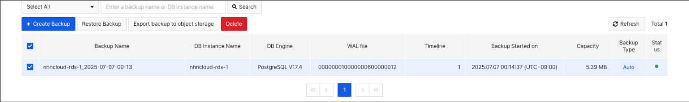

❷ Alternatively, on the **Backup** tab, select the backup file you want to export and click **Export Backup to Object Storage**.

!!! tip "Note"
    For manual backups, if the source DB instance that performed the backup was deleted, you cannot export the backup.

## Backup Method { #backup-method }

Full and incremental backups are available.

### Full Backup { #full-backup }

Backs up all data in the DB instance.

### Incremental Backup { #incremental-backup }

Incremental backups only back up data changes since the baseline backup was performed. Recommended if your data is mostly immutable. Supported only on PostgreSQL version 17 or later.
Incremental backups are always performed on the DB instance that performed the baseline backup.
When restoring to an incremental backup, the restore proceeds from the baseline full backup first, and all increments are reflected sequentially until the selected incremental backup is reached.

!!! danger "Caution"
    Restoring from incremental backups may take more time than restoring from a full backup, which is proportional to the sum of the capacity of the incremental backups required for the restore.

#### Baseline Backup

Incremental backups require a backup to baseline data changes on. An incremental backup can also be the baseline backup for a new incremental backup.

The following constraints apply to backups that serve as the baseline for an incremental backup. These apply to both manual and automatic incremental backups.

* A backup in an error state cannot be a baseline backup.
* A backup created before the last failover cannot be the baseline backup.
* A backup created before the last DB engine version upgrade cannot be a baseline backup.
* If an incremental backup already exists that is based on that backup, it cannot be the baseline backup. However, if the previous increment failed, you can increment based on the same backup.
* A backup performed with the `summarize_wal` parameter disabled cannot be a baseline backup.

When an incremental backup runs according to [Auto Backup](#auto-backup), a baseline backup that satisfies the above constraints along with the following additional constraints is automatically selected. If no baseline backup satisfies the constraints, a full backup is performed regardless of the auto backup strategy.

* A backup performed on a Standby or Read Replica that is in the Replication Stopped state cannot be a baseline backup.
* If a new full backup was created after that backup was created, it cannot be the baseline backup.

## Snapshot Backup { #snapshot-backup }
While existing backup methods can degrade performance when run directly on the DB instance, **Storage Snapshot Backup** leverages Cinder storage snapshots to perform backups—available only for Primary DB instances or DB instances with the `archive_mode` parameter set to `always`.
Because all heavy lifting—such as validation and file conversion—is offloaded to a separate server, your database maintains peak performance even during backups.

### Key Features { #key-features }

* Performance maintenance: DB instance performance is maintained at 100% even during backup operations.
* Improved reliability: Rigorous verification processes ensure the reliability of your backup data.
* Temporary High Availability (HA) suspension: HA features may be briefly paused during snapshot creation to ensure strict data consistency.

### Pricing { #pricing }
Unlike the existing backup method, snapshot backup separately charges for the cost of the resources used to perform the backup.

| Category | Existing Backup Method | Snapshot Backup Method |
|-------|-----------------------------|---------------------------|
| Billing Method | Included in the DB instance usage fee (no separate charge) | Separate charge for backup-dedicated resource costs |
| Billing Target | Object Storage upload cost (separate) | Shared backup server + volume + snapshot + Object Storage |

* Shared backup server fee: This is the usage fee for the shared backup server used to validate and convert backup data.
    * Even though shared resources are used, billing is based only on the time each customer actually uses.

## Restore { #restore }

You can use backup to restore data to any point in time. Restoration always creates a new DB instance and restoration cannot be performed on an existing DB instance. You can only restore to the same DB engine version as the original DB instance from which you performed the backup. It supports backup restore, which restores to the point in time when the backup was created, and Point-in-Time Restore, which restores to a specific point in time that you want.

!!! danger "Caution"
    Restoration might fail if the data storage size of the DB instance that you want to restore is smaller than the data storage size of the source DB instance that you backed up, or if you use a different parameter group than the parameter group of the source DB instance.

### Backup Restore { #backup-restore }

You do not need the original DB instance that performed the backup by restoring only the backup file. To restore a backup from the console:

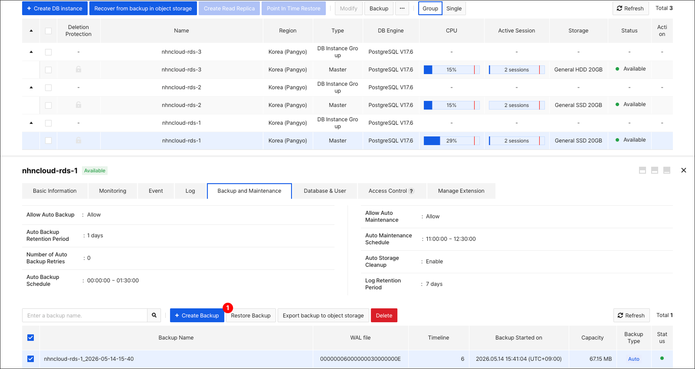

❶ Select the backup file you want to restore on the **Backup** tab, and then click **Backup Restore** to go to the Restore DB instance screen.

Or

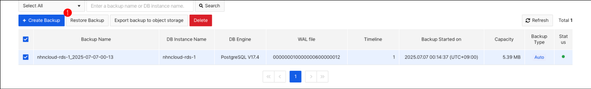

❶ On the Backup tab, select the backup file you want to restore and then click **Backup Restore**.

### Point-in-time Restore { #point-in-time-restore }

You can use point-in-time restoration to restore to a specific point-in-time or specific LSN in the WAL log. To restore a point in time, you need a backup file and a WAL log from the time you performed the backup to the time you want to restore it. WAL logs are stored in the storage of the original DB instance where the backup takes place. Short WAL log retention periods allow more storage capacity, but recovery to the desired point in time can be challenging. For the case listed below, you might not be able to restore to the desired point in time because you do not have the WAL log required for point in time restoration.

* When you have deleted the WAL log of the source DB instance for securing capacity
* When the WAL log is automatically deleted based on the Auto Backup Retention Period
* When WAL logs are corrupted or deleted for various other reasons

To restore a point in time from the console

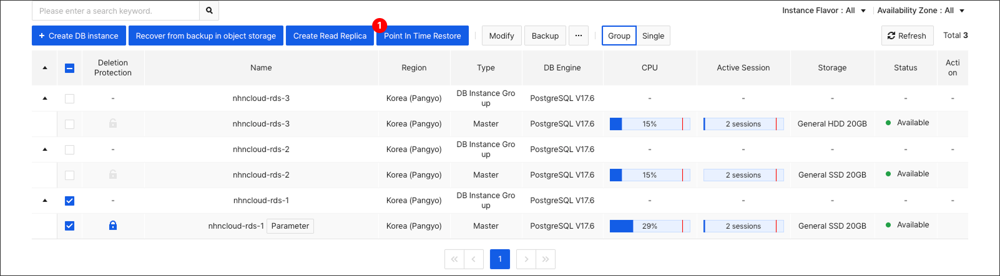

❶ Select the DB instance you want to restore to a point in time and click **Point In Time Restore** to go to the page where you can set up a point in time restore.

#### Restore with Timestamp

When restoring with Timestamp, restore it based on the backup file closest to the selected time point and apply the WAL log to the desired time point.

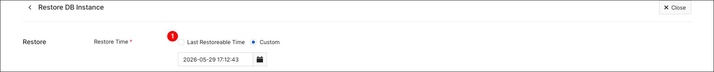

❶ Select a time to restore. You can restore it to the most recent point in time, or enter the specific point in time that you want.

### Restore using Backup in Object Storage { #restore-using-backup-in-object-storage }

You can create a DB instance using a backup file exported from RDS for PostgreSQL to object storage.

(1) See [Export Backup File](#export-backup-files) to export a backup of RDS for PostgreSQL to object storage.

(2) Access the console of the project you want to restore, and on the **DB Instance** tab, click the Restore from backup in Object Storage button.

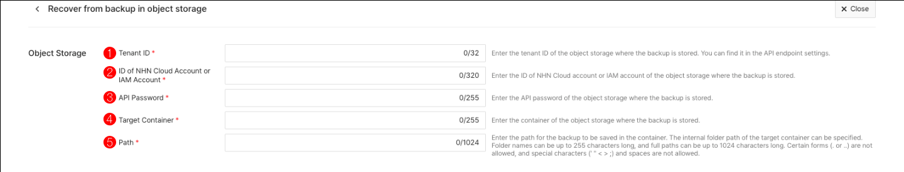

❶ Enter the tenant ID of the object storage where the backup is stored. You can find the tenant ID in the API endpoint settings.
❷ Enter the NHN Cloud account or IAM account of the object storage where the backup is stored.
❸ Enter the API password for the object storage where the backup is stored.
❹ Enter the container in object storage where the backup is stored.
❺ Enter the path to the backup that will be stored in the container. The folder name can be up to 255 bytes, and the full path can be up to 1024 bytes. You cannot use certain forms (. or ..), and you cannot enter special characters (' " < > ;) and spaces.
❻ Refer to the [Create DB instance](db-instance/#create-db-instance) section to enter the remaining settings and click the **Restore to Backup in Object Storage** button.