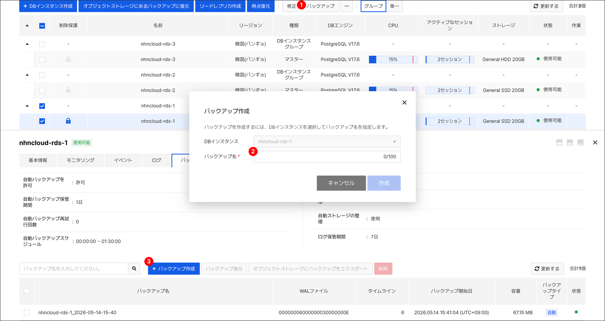
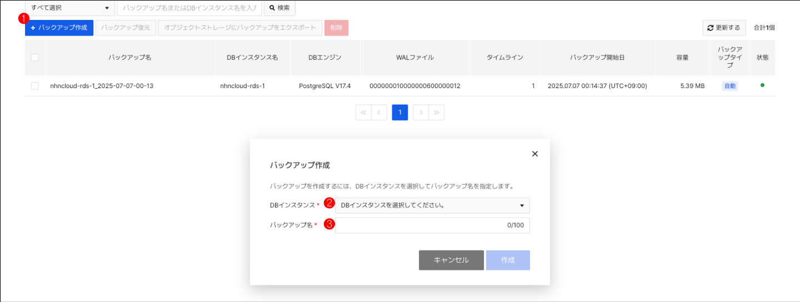
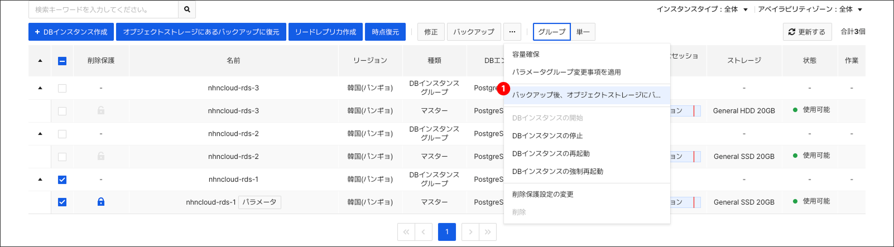
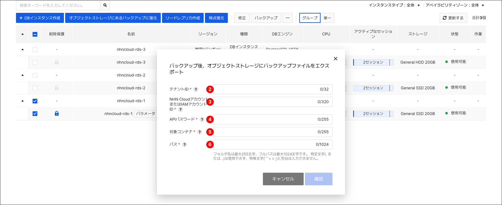
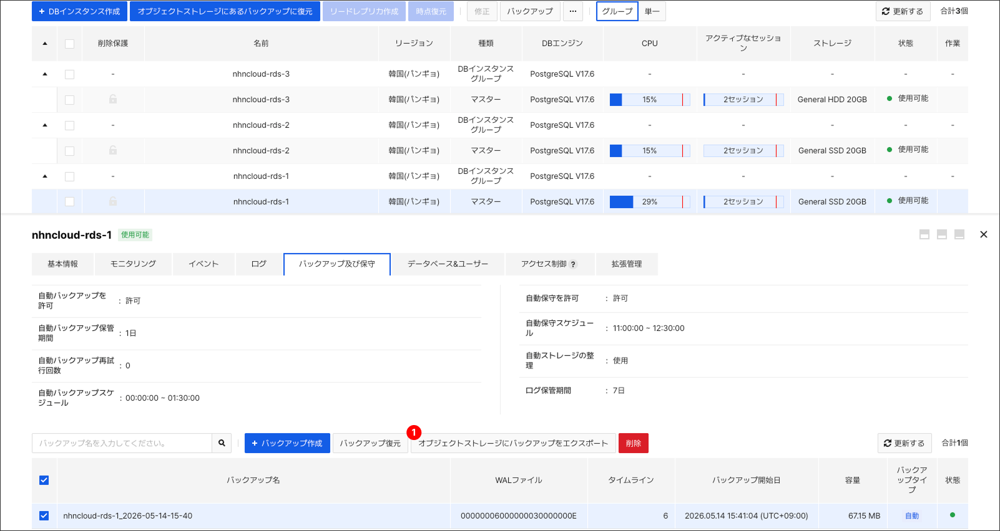
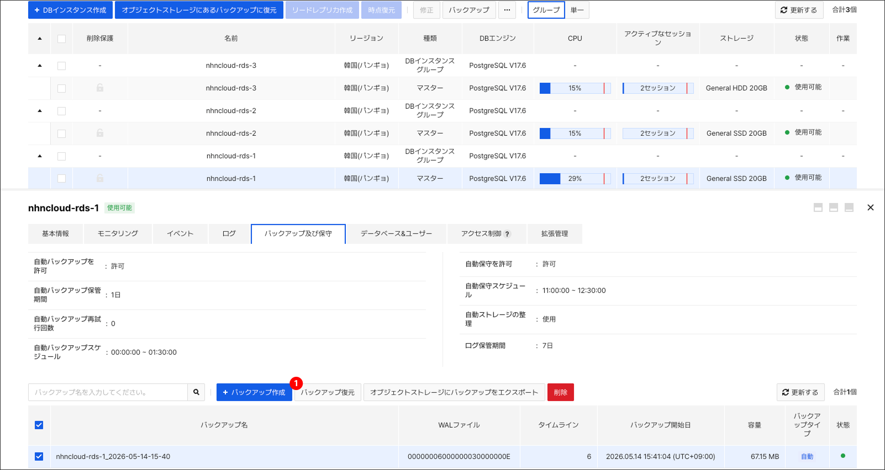
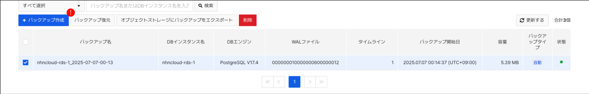
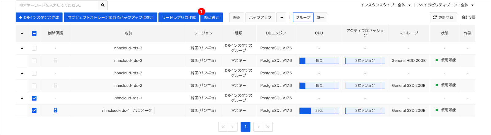
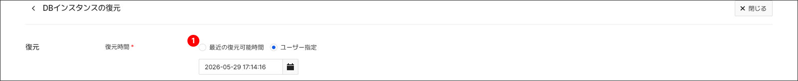
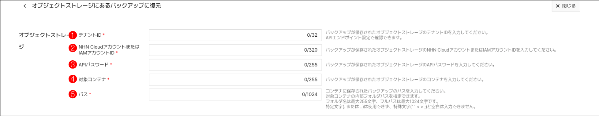

<!-- machine_translated: true -->

<!-- pre-align:aligned sig=c164d17a97df -->

## Database > RDS for PostgreSQL > バックアップ及び復元 { #database-rds-for-postgresql-backup-and-restore }

## バックアップ { #backup }

障害状況に備えて、DBインスタンスのデータベースを復旧できるように事前に準備できます。必要なときはいつでもコンソールでバックアップを実行したり、定期的にバックアップが実行されるように設定できます。バックアップが実行されている間は、当該DBインスタンスのストレージの性能低下が発生する可能性があります。サービスに影響を与えないように、サービスの負荷が少ない時間にバックアップすることを推奨します。バックアップによる性能低下を避けたい場合は、高可用性構成を使用したり、前回のバックアップ以降のデータの増分のみをバックアップしたり、Read Replicaでバックアップを実行したりすることもできます。

RDS for PostgreSQLでは、pg_basebackupツールを利用してデータベースをバックアップします。外部PostgreSQLのバックアップに復元したり、RDS for PostgreSQLのバックアップに復元したりするには、RDS for PostgreSQLで使用するpg_basebackupと同じバージョンを使用する必要があります。DBエンジンバージョンに応じたpg_basebackupバージョンは次のとおりです。

| PostgreSQLバージョン | pg_basebackupバージョン |
|-----------------|--------------------|
| <strong>17</strong> |  |
| 17.10           | 17.10              |
| 17.6            | 17.6               |
| 17.4            | 17.4               |
| 17.2            | 17.2               |
| <strong>14</strong> |  |
| 14.23           | 14.23              |
| 14.19           | 14.19              |
| 14.17           | 14.17              |
| 14.15           | 14.15              |
| 14.6            | 14.6               |

pg_basebackupのインストールに関する詳しい説明は[PostgreSQL Webサイト](https://www.postgresql.org/docs/17/app-pgbasebackup.html)を参照してください。

バックアップ時に適用される設定項目は下記の通りで、自動バックアップと手動バックアップの両方に適用されます。

### 手動バックアップ { #manual-backup }

特定の時点のデータベースを永続的に保存するには、コンソールで手動バックアップを行います。手動バックアップは、自動バックアップと違って、明示的にバックアップを削除しない限り、DBインスタンスが削除される時に一緒に削除されません。 コンソールで手動バックアップを実行するには

❶バックアップするDBインスタンスを選択した後、**バックアップ**をクリックすると、**バックアップ作成** ポップアップウィンドウが表示されます。
- DBインスタンスを選択せずに**バックアップ**をクリックすると、**バックアップ作成**ポップアップウィンドウ内のドロップダウンメニューからDBインスタンスを選択できます。
❷バックアップの名前を入力します。以下のような制約事項があります。

* バックアップ名は、リージョンごとに固有の名前でなければなりません。
* バックアップ名は1～100文字まで、英字、数字、一部の記号(-, _, .)だけを入力することができ、最初の文字は英字のみ使用できます。

または**バックアップ**タブで

❶ **+ バックアップ作成**をクリックすると、**バックアップ作成**ポップアップウィンドウが表示されます。
❷バックアップを実行するDBインスタンスを選択します。
❸バックアップの名前を入力した後、**作成**をクリックすると、バックアップの作成をリクエストできます。

#### 手動増分バックアップの作成

**バックアップ**タブで基準バックアップを選択し、**増分バックアップ作成**をクリックして増分バックアップを作成できます。一部のバックアップは基準バックアップとして選択できません。基準バックアップの詳細については、[基準バックアップ](#baseline-backup)を参照してください。

### 自動バックアップ { #auto-backup }

手動でバックアップを実行する場合以外にも、復元作業のために必要な場合、または自動バックアップスケジュールの設定により、自動バックアップが実行されることがあります。DBインスタンスのバックアップ保管期間を1日以上に設定すると、自動バックアップが有効になり、指定された時間にバックアップが実行されます。自動バックアップはDBインスタンスとライフサイクルが同じです。DBインスタンスが削除されると、保管された自動バックアップはすべて削除されます。自動バックアップでサポートする設定項目は次の通りです。

#### 自動バックアップの保管期間（日）

* バックアップをストレージに保存する期間を設定します。最大 730 日まで保管でき、バックアップ保管期間が変更された場合、保管期間が過ぎた自動バックアップファイルはすぐに削除されます。

  !!! danger "注意"
      増分方式で作成されたバックアップは、自動バックアップの保管期間が経過していなくても、基準バックアップが削除される際に一緒に削除されます。

#### 自動バックアップリトライ回数

* DML クエリの負荷またはさまざまな理由で自動バックアップが失敗した場合、リトライするように設定できます。最大 10 回までリトライできます。リトライ回数が残っていても、バックアップ実行時間の設定によってはリトライしない場合があります。

#### 自動バックアップ戦略

* 自動バックアップを実行する戦略を指定できます。
    * 毎日全体バックアップ: 毎日全データをバックアップします。
    * 毎日全体および増分バックアップ: 毎日全データを1回バックアップし、数回増分バックアップを実行します。
    * 週次全体バックアップおよび日次増分バックアップ: 特定の曜日に全データを1回バックアップし、残りの曜日には増分バックアップを1回実行します。
    * 毎日スナップショットバックアップ: 毎日全データをスナップショットとしてバックアップします。

#### 全体バックアップの曜日

* 週次全体バックアップおよび日次増分バックアップ戦略を使用する場合にのみ指定できます。全体バックアップの曜日は1つ以上選択する必要があります。選択した曜日には全体バックアップが実行され、選択していない曜日には増分バックアップが実行されます。

#### バックアップ実行対象

* 自動バックアップを実行するDBインスタンスを選択します。Primary 以外に Standby や Read Replica を選択すると、Primary のバックアップ負荷を軽減できます。
* バックアップ実行方式を次のいずれかで指定できます。
    * 選択した候補のうち 1 台: 選択したDBインスタンスのうち、システム負荷が最も低い 1 台で自動的にバックアップを実行します。
    * 選択した候補すべて: 選択したすべてのDBインスタンスでバックアップを実行します。

#### バックアップ実行時間

* バックアップが自動的に実行される時間を設定できます。バックアップ開始時間とバックアップウィンドウで構成されます。バックアップ実行時間は重複しないように複数回設定できます。バックアップ開始時間を基準として、バックアップウィンドウ内の任意の時点にバックアップを実行します。バックアップウィンドウはバックアップの総実行時間とは関係ありません。バックアップにかかる時間はデータベースのサイズに比例し、サービスの負荷によって異なります。バックアップが失敗した場合、バックアップウィンドウを超えていなければ、バックアップリトライ回数に従ってバックアップをリトライします。

自動バックアップ名は `{DBインスタンス名}_yyyy-MM-dd-HH-mm` の形式で付与されます。

!!! danger "注意"
    前のバックアップが終了していない等の状況では、バックアップが実行されない場合があります。
    スケジュール上、増分バックアップを実行する番であっても、増分可能な基準バックアップが存在しない場合は全体バックアップが実行される場合があります。
    増分可能な基準バックアップの詳細については、[基準バックアップ](#baseline-backup) の項目を参照してください。

### バックアップストレージ及び課金 { #backup-storage-and-pricing }

すべてのバックアップファイルは、内部バックアップストレージにアップロードして保存します。手動バックアップの場合、別途削除するまで永続的に保存され、バックアップ容量に応じてバックアップストレージの課金が発生します。自動バックアップの場合、設定した保管期間だけ保存され、自動バックアップファイルの全体サイズのうち、DBインスタンスのストレージサイズを超えた容量に対して課金されます。バックアップファイルが保存されている内部バックアップストレージに直接アクセスすることはできません。

### バックアップエクスポート { #export-backup }

#### バックアップを実行しながらファイルをエクスポート

バックアップ後にバックアップファイルをユーザーのオブジェクトストレージにエクスポートできます。増分バックアップはサポートされていません。

❶バックアップするDBインスタンスを選択後、ドロップダウンメニューで**バックアップ後オブジェクトストレージにバックアップファイルをエクスポート**をクリックすると、設定のポップアップ画面が表示されます。
❷バックアップが保存されるオブジェクトストレージのテナントIDを入力します。テナントIDはAPIエンドポイント設定で確認できます。
❸バックアップが保存されるオブジェクトストレージのNHN CloudアカウントまたはIAMアカウントを入力します。
❹バックアップが保存されるオブジェクトストレージのAPIパスワードを入力します。
❺バックアップが保存されるオブジェクトストレージのコンテナを入力します。
❻コンテナに保存されるバックアップのパスを入力します。フォルダ名は最大255バイト、フルパスは最大1024バイトです。特定の形式(.または..)は使用できず、特殊文字(' " < > ;)や空白は入力できません。

#### バックアップファイルをエクスポート

内部バックアップストレージに保存されたバックアップファイルをユーザーオブジェクトストレージにエクスポートできます。増分バックアップはサポートされていません。

❶バックアップを実行した原本のDBインスタンスの詳細タブでエクスポートするバックアップファイルを選択し、**オブジェクトストレージにバックアップをエクスポート**をクリックすると、バックアップをエクスポートするためのポップアップ画面が表示されます。

❷または**バックアップ**タブでエクスポートするバックアップファイルを選択し、**オブジェクトストレージにバックアップをエクスポート**をクリックします。

!!! tip "ヒント"
    手動バックアップでは、バックアップを実行した元のDBインスタンスが削除されている場合、バックアップをエクスポートすることはできません。

## バックアップ方式 { #backup-method }

全体バックアップ方式と増分バックアップ方式が提供されます。

### 全体バックアップ { #full-backup }

DBインスタンスのすべてのデータをバックアップします。

### 増分バックアップ { #incremental-backup }

基準バックアップが実行された後のデータ変更分のみを増分方式でバックアップします。変更が少ないデータが主体の場合にお勧めします。PostgreSQL 17 バージョン以上でのみサポートされます。
増分バックアップは常に、基準バックアップを実行した DBインスタンスで実行されます。
増分バックアップで復元する場合は、基準となる全体バックアップを先に復元した後、選択した増分バックアップまでの増分を順番に適用します。

!!! danger "注意"
    増分バックアップで復元する場合は、全体バックアップで復元する場合より多くの時間がかかる場合があり、これは復元に必要な増分バックアップ容量の合計に比例します。

#### 基準バックアップ

増分バックアップには、データ変更の基準となるバックアップが必要です。増分バックアップも、新しい増分バックアップの基準バックアップになることができます。

増分バックアップの基準となるバックアップには、次の制約事項があります。手動および自動の増分バックアップ時に共通して適用されます。

* エラー状態のバックアップは、基準バックアップになることはできません。
* 最後のフェイルオーバー以前に作成されたバックアップは、基準バックアップになることはできません。
* 最後のDBエンジンバージョンアップグレード以前に作成されたバックアップは、基準バックアップになることはできません。
* すでにそのバックアップを基準とした増分バックアップが存在する場合、基準バックアップになることはできません。ただし、以前の増分が失敗した場合は、同じバックアップを基準に増分することができます。
* `summarize_wal` パラメータが無効の状態で実行されたバックアップは、基準バックアップになることはできません。

[自動バックアップ](#auto-backup)に従って増分バックアップが実行される場合、上記の制約事項とともに次の追加制約事項を満たす基準バックアップが自動的に選択されます。制約事項を満たす基準バックアップが存在しない場合は、自動バックアップ戦略に関係なく全体バックアップを実行します。

* レプリケーションが中断された状態の Standby、Read Replica で実行されたバックアップは、基準バックアップになることはできません。
* そのバックアップの作成以降に新しい全体バックアップが作成された場合、基準バックアップになることはできません。

## スナップショットバックアップ { #snapshot-backup }

従来のバックアップ方式は、バックアップアプリケーションがDBインスタンスで実行されるため、バックアップ中に性能低下が発生する可能性がありますが、**ストレージスナップショットバックアップ**は、Primaryまたは`archive_mode`パラメータが`always`のDBインスタンスに限り、Cinderストレージスナップショットを活用してバックアップを実行します。
スナップショット作成後、共用バックアップサーバーでデータの有効性検査およびファイル変換を実行するため、バックアップ中もDBインスタンスの性能に影響を与えません。

### 主な特徴 { #key-features }

* パフォーマンスの維持: バックアップ実行中も、DBインスタンスのパフォーマンスが100%維持されます。
* 安定性の向上: 別途の検証プロセスを通じて、バックアップデータの信頼性を保証します。
* 高可用性の一時停止: スナップショット作成時点では、データの一貫性のために高可用性機能が一時停止される場合があります。

### 料金体系 { #pricing }

スナップショットバックアップは、既存のバックアップとは異なり、バックアップ実行に使用されたリソース費用が別途請求されます。

| 区分    | 既存のバックアップ方式                    | スナップショットバックアップ方式                 |
|-------|-----------------------------|---------------------------|
| 請求方式 | DBインスタンスの使用料金に含まれる(別途請求なし) | バックアップ専用のリソース費用を別途請求        |
| 課金対象 | オブジェクトストレージのアップロード費用(別途)              | パブリックバックアップサーバー + ボリューム + スナップショット + オブジェクトストレージ |

* パブリックバックアップサーバー料金: バックアップデータの検証及び変換に使用するパブリックバックアップサーバーの使用料金です。
    * パブリックリソースを使用しても、各顧客が実際に使用した時間分のみ課金されます。

## 復元 { #restore }

バックアップを利用して希望の時点にデータを復元できます。復元時は常に新しいDBインスタンスが作成され、既存のDBインスタンスに復元することはできません。バックアップを実行した元のDBインスタンスと同じDBエンジンのバージョンにのみ復元できます。バックアップが作成された時点に復元するバックアップ復元、希望する特定の時点に復元する時点復元をサポートします。

!!! danger "注意"
    復元するDBインスタンスのデータストレージサイズが、バックアップを実行した元のDBインスタンスのデータストレージサイズより小さい場合、または元のDBインスタンスのパラメータグループと異なるパラメータグループを使用する場合、復元に失敗する可能性があります。

### バックアップ復元 { #backup-restore }

バックアップファイルだけで復元するため、バックアップを実行した元のDBインスタンスが必要ありません。コンソールでバックアップを復元するには

❶DBインスタンスの詳細タブで復元するバックアップファイルを選択した後、**バックアップ復元**をクリックすると、DBインスタンスの復元画面に移動します。

または

❶**バックアップ**タブで復元するバックアップファイルを選択した後、**バックアップ復元**をクリックします。

### 時点復元 { #point-in-time-restore }

時点復元を利用して、希望する特定の時点またはWALログの特定のLSNに復元できます。時点復元をするためには、バックアップファイルとバックアップを実行した時点から復元を希望する時点までのWALログが必要です。WALログは、バックアップが行われる元のDBインスタンスのストレージに保存されます。WALログの保管期間が短い場合、ストレージ容量をより多く使用できますが、希望する時点への復元が難しい場合があります。下記のような場合、時点復元に必要なWALログがないため、希望の時点に復元できない場合があります。

* 容量確保のために元のDBインスタンスのWALログを削除した場合
* 自動バックアップの保管期間に基づいてWALログが自動的に削除された場合
* その他の様々な理由でWALログが破損または削除された場合

Webコンソールで時点復元を行うには

❶時点復元するDBインスタンスを選択した後、**時点復元**をクリックすると、時点復元を設定できるページに移動します。

#### Timestampを利用した復元

Timestampを使用した復元の場合は、選択した時点と最も近いバックアップファイルを基準に復元を行った後、希望する時点までのWALログを適用します。

❶復元時刻を選択します。最も最近の時点に復元するか、希望する特定の時点を直接入力できます。

### オブジェクトストレージにあるバックアップを利用した復元 { #restore-using-backup-in-object-storage }

RDS for PostgreSQLからオブジェクトストレージにエクスポートしたバックアップファイルを利用してDBインスタンスを作成できます。

(1) [バックアップファイルエクスポート](#export-backup-files)項目を参考にして、RDS for PostgreSQLのバックアップをオブジェクトストレージにエクスポートします。

(2)復元するプロジェクトのコンソールに接続して、**DBインスタンス**タブで**オブジェクトストレージにあるバックアップで復元**ボタンをクリックします。

❶バックアップが保存されたオブジェクトストレージのテナントIDを入力します。テナントIDはAPIエンドポイント設定で確認できます。
❷バックアップが保存されたオブジェクトストレージのNHN CloudアカウントまたはIAMアカウントを入力します。
❸バックアップが保存されたオブジェクトストレージのAPIパスワードを入力します。
❹バックアップが保存されたオブジェクトストレージのコンテナを入力します。
❺コンテナに保存されるバックアップのパスを入力します。フォルダ名は最大255バイト、フルパスは最大1024バイトです。特定の形式(.または..)は使用できず、特殊文字(' " < > ;)や空白は入力できません。
❻ [DBインスタンス作成](db-instance/#create-db-instance)項目を参照して残りの設定を入力し、**オブジェクトストレージにあるバックアップで復元**ボタンをクリックします。
